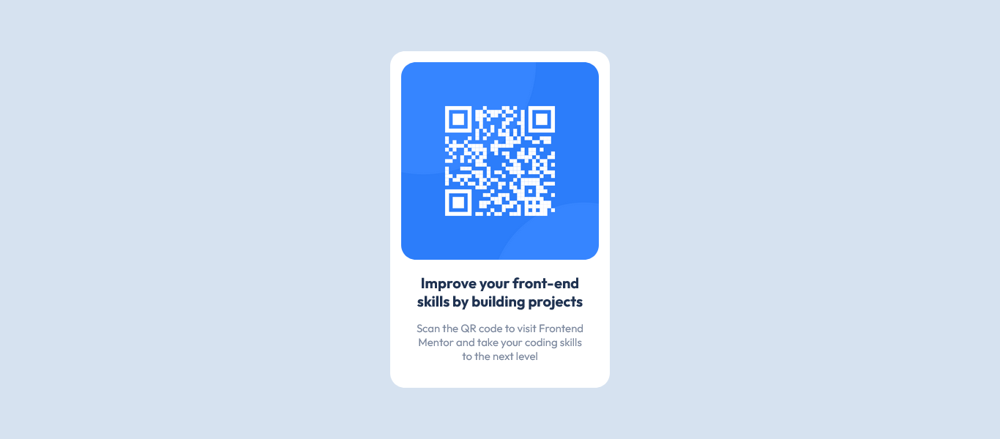
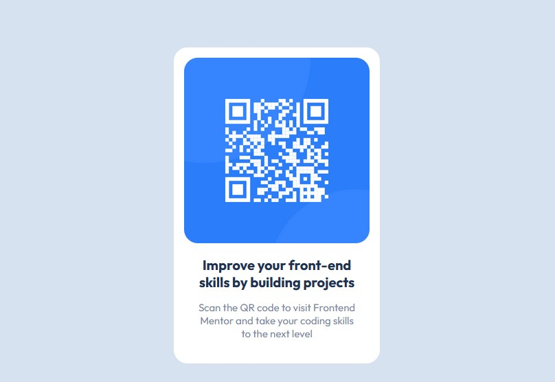
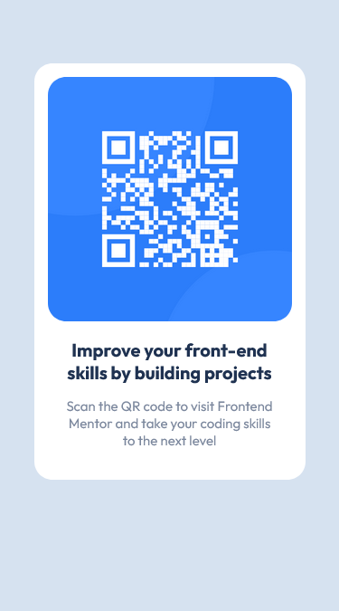

# Frontend Mentor - QR code component solution

This is a solution to the [QR code component challenge on Frontend Mentor](https://www.frontendmentor.io/challenges/qr-code-component-iux_sIO_H). Frontend Mentor challenges help you improve your coding skills by building realistic projects. 

## Table of contents

- [Overview](#overview)
  - [Screenshot](#screenshot)
  - [Links](#links)
- [My process](#my-process)
  - [Built with](#built-with)
  - [What I learned](#what-i-learned)
  - [Useful resources](#useful-resources)
- [Author](#author)

## Overview

### Screenshot





### Links

- Solution URL: [Add solution URL here](https://your-solution-url.com)
- Live Site URL: [Add live site URL here](https://your-live-site-url.com)

## My process

### Built with

- Semantic HTML5 markup
- CSS custom properties
- CSS Variable
- CSS Block
- Mobile-first workflow

### What I learned

CSS Layout - Horizontal & Vertical Align.
Center Align Elements - To horizontally center a block element (like <main>), use margin: auto;

```html
<main>Some HTML code I'm proud of</main>
```
```css
main {
  margin: auto;
}
```

### Useful resources

- [CSS Layout - Horizontal & Vertical Align](https://www.w3schools.com/css/css_align.asp) - This helped me to understand how CSS layout really works.
- [PX to REM converter](https://nekocalc.com/px-to-rem-converter) - This is an amazing web app that I used to convert PX to REM. I'd recommend it to anyone that find it difficult to convert PX to REM.

## Author

- Website - [Michael Victor](https://www.webtor.xyz)
- Frontend Mentor - [YourmixJNR](https://www.frontendmentor.io/profile/YourmixJNR)
- Twitter - [YourmixJNR](https://twitter.com/YourmixJNR)
